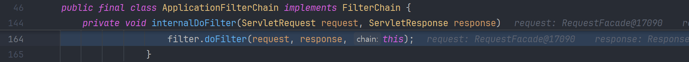

## 개요

Spring MVC에서 응답을 가로채거나 수정하려는 경우, `Filter` 와 `Interceptor` 에서 처리할 수 있지 않을까 생각할 수 있다. 하지만 결론부터 말하자면, **`@ResponseBody`** 나 **`ResponseEntity`** 를 사용하는 경우, 해당 단계에서는 이미 **직렬화(serialization)가 완료된 이후**이기 때문에, **Response의 body를 수정하는 것은 사실상 어렵다**.

이번 글에서는 클라이언트의 요청이 Spring MVC 내부에서 어떤 흐름을 거치는지, 디버깅을 통해 추적한 내용을 바탕으로 그 이유를 알아보고자 한다. 

 

## 📖 주요 메서드 흐름 톺아보기

### 1) **FilterChain**: filterChain.doFilter()

가장 먼저 요청이 진입하는 부분이다.

**`filterChain.doFilter()`** 를 호출하면, 서블릿 컨테이너는 다음 필터 또는 최종 서블릿인 DispatcherServlet으로 요청 처리를 넘긴다. 이 시점부터 Spring MVC의 요청 처리 흐름이 시작된다.

### 2) **DispatcherServlet**: service()

Spring의 핵심인 DispatcherServlet이 요청을 받아서 처리한다. 내부적으로는 `doDispatch()` 를 호출하는데, 여기가 바로 본격적인 요청 처리 로직이 시작되는 지점이다.

#### **doDispatch()**

`doDispatch()` 에서 일어나는 핵심 로직들을 살펴보면 다음과 같다.

1. `getHandler()` : 요청에 맞는 컨트롤러(Handler) 찾기
2. `getHandlerAdapter()` : 찾은 Handler를 실행할 수 있는 Adapter 찾기
3. `applyPreHandle()` : 전처리(Interceptor의 `preHandle()`) 실행
4. **`handle()`** : 컨트롤러 메서드를 실행하여, 요청 처리하기
5. `applyPostHandle()` : 후처리(Interceptor의 `postHandle()`) 실행
6. `processDispatchResult()` : View Resolver를 통한 응답 처리
7. `triggerAfterCompletion()` : 예외 발생 시 처리

여기서 우리가 살펴봐야 하는 부분은 **`handle()`** 이다.

> ModelAndView가 아닌 `@ResponseBody` 를 사용하는 경우, `handle()` 내에서 `HttpMessageConverter` 가 객체를 JSON 등으로 직렬화하여 `HttpServletResponse` 에 직접 작성한다. 따라서 이후 `processDispatchResult()` 단계에서는 View 렌더링이 수행되지 않는다.

 

### 3) **RequestMappingHandlerAdapter**: handle() 안에서 일어나는 일들
RequestMappingHandlerAdapter는 `@RequestMapping` 으로 선언된 컨트롤러 메서드를 처리하고, 그 결과를 HTTP 응답으로 변환해주는 핸들러 어댑터다.

#### 3.1) invokeHandlerMethod(): invokeAndHandle() 

`invokeHandlerMethod()` 는 요청 처리에 필요한 객체들을 초기화하는 과정을 거친 후, 실제 컨트롤러의 메서드를 실행하는 `invokeAndHandle()` 를 호출한다.

#### 3.2) invokeAndHandle(): handle**ReturnValue**()

`invokeAndHandle()` 은 먼저 **`invokeForRequest()` 를 통해 컨트롤러 메서드를 실행**하고, 그 반환값을 **`handleReturnValue()`** 에 전달하여 **응답 처리** 로직으로 넘긴다.

#### 3.3) handleReturnValue(): writeWith**MessageConverters**()

`handleReturnValue()` 는 컨트롤러의 반환값을 `HttpEntity` 로 변환하고 상태 코드와 헤더를 설정한다. 그리고 `writeWithMessageConverters()` 를 호출하여 응답을 처리한다.

> 다음 이미지의 주석을 확인해보면 알 수 있듯이, 3.3에서 호출하는 `flush()` 는 확실하게 flush했다는 것을 보장하기 위한 장치로, 3.5에서 호출하는 `flush()` 가 실제 응답이 전송되는 최초 시점이다.

#### 3.4) writeWithMessageConverters(): genericConverter.**write**(body, …)

`writeWithMessageConverters()` 는 등록되어 있는 **`HttpMessageConverter`** 목록 중 **적합한 converter를 선택**해서, Response Body를 작성하는 `write()` 함수를 호출한다.  

- 이 때 사용되는 `outputMessage` 는 `ServletServerHttpResponse` 타입이다.

- JSON 응답의 경우, **`MappingJackson2HttpMessageConverter`** 가 선택되어, 내부적으로 Jackson의 `ObjectMapper` 를 통해 객체를 **JSON으로 직렬화**한다.

> `@ResposeBodyAdvice` 를 사용한다면, `beforeBodyWrite()` 로 body를 직렬화하기 전에 개입할 수 있다.
{: .prompt-tip }

#### 3.5) write(): **writeInternal()** → **flush()**
Converter에서 HTTP 응답 헤더를 설정한 후, `writeInternal()` 을 통해 객체를 직렬화하여 HTTP 응답 본문에 쓴다. 마지막으로 `outputMessage.getBody().flush()` 를 호출해 출력 버퍼에 있던 데이터를 클라이언트에게 전송한다.

#### 3.6) writeInternal()
해당 메서드에서 Jakcson의 `ObjectMapper.writeValue()` 를 통해 Java 객체를 JSON 문자열로 직렬화하고 응답 스트림에 기록한다.

 

## 🤔 잠깐! 그래서 왜 Filter/Interceptor에서 Response body를 수정할 수 없는건데?

위의 3.5 단계에서 호출된 `outputMessage.getBody().flush()` 를 자세히 살펴보면 그 이유를 명확히 알 수 있다.

이 `flush()` 메서드는 내부적으로 `flushBuffer()` 를 호출하는데, 이는 `ServletResponse` 인터페이스에 선언되어 있다.

이 메서드는 ~={orange}**버퍼에 있는 모든 내용을 클라이언트에게 강제로 전송**=~한다. 이 시점에 서블릿 응답은 자동으로 ~={orange}**commit**=~이 되는데, 이는 **상태 코드와 헤더가 전송되었다**는 뜻이다. 

그리고 여기서 중요한 점은 `@ResponseBody` 나 `ResponseEntity` 를 사용하는 경우, 위에서 설명한 `MessageConverter.write()` 단계에서
1. body를 직렬화된 데이터로 출력 스트림에 작성한 후
2. `flush()` 를 호출하기 때문에

body는 상태 코드, 헤더와 함께 클라이언트로 전송된다는 점이다.

이미 전송된 Response를 건드릴 방법은 없기 때문에, 그 이후 시점인 Interceptor의 `postHandle()` 이나 Filter의 `doFilter()` 에서는 Response의 body를 더 이상 수정할 수 없다.

 

## ✅ 정리

위에서 살펴본 흐름을 시퀀스 다이어그램으로 정리해보면 다음과 같다.

- `@ResponseBody`, `ResponseEntity` 등을 사용하는 컨트롤러는 내부적으로 `HttpMessageConverter.write()` 을 사용한다.
- 이 과정에서 `flush()` 가 호출되어 응답이 `committed` 상태로 변경되면서, 상태 코드와 헤더, body 직렬화 결과가 모두 네트워크를 통해 클라이언트에게 전송된다.
- 따라서 그 이후의 시점인 Interceptor의 `postHandle()` 이나 Filter의 `doFilter()` 등에서는 응답을 수정할 수 없다.

만약 `@ResponseBody`, `ResponseEntity` 를 사용할 때 응답을 조작하고 싶다면, Spring에서 제공해주는 `@ResponseBodyAdvice` 를 활용하여 직렬화 직전에 개입하는 방식으로 구현할 수 있다.

 

> [참고] Filter/Interceptor에서 Response를 수정하는 방법
> - [Spring Filter에서 Response 수정하기](https://medium.com/sjk5766/spring-filter%EC%97%90%EC%84%9C-response-%EC%88%98%EC%A0%95%ED%95%98%EA%B8%B0-7de6da9836f5)
> - [Spring Interceptor에서 Response 수정하기](https://medium.com/sjk5766/spring-interceptor%EC%97%90%EC%84%9C-response-%EC%88%98%EC%A0%95%ED%95%98%EA%B8%B0-5b6ea3a5a270)
> 
> 위 블로그 게시물에서 Filter와 Interceptor에서 Response를 수정하는 방법에 대해 자세하게 작성해주셨는데, 짧게 요약하면 특수한 케이스에서는 가능하다고 한다. 하지만 실무에서는 이런 방식으로 Response를 수정할 일은 없을 것이라고도 코멘트 달아주셨다.
{: .prompt-info }

 

## 참고
- [what-does-httpservletresponse-is-committed-mean](https://stackoverflow.com/questions/39725888/what-does-httpservletresponse-is-committed-mean)
- [Spring Filter에서 Response 수정하기](https://medium.com/sjk5766/spring-filter%EC%97%90%EC%84%9C-response-%EC%88%98%EC%A0%95%ED%95%98%EA%B8%B0-7de6da9836f5)
- [Spring Interceptor에서 Response 수정하기](https://medium.com/sjk5766/spring-interceptor%EC%97%90%EC%84%9C-response-%EC%88%98%EC%A0%95%ED%95%98%EA%B8%B0-5b6ea3a5a270)

