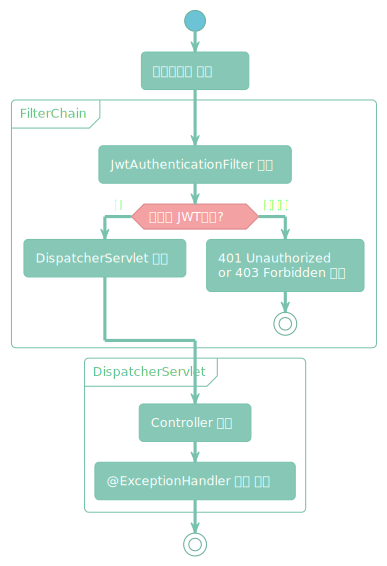

## 개요

Expired된 Access Token을 넘겨서, **`JwtAuthenticationFilter`**에서 **`ExpiredJwtException`** 이 발생했다.

그런데 **`GlobalExceptionHandler`**에 정의해둔 공통 응답 형식이 반환되지 않았다.

😥 당연한 결과다... Spring MVC에 도달하지 않았기 때문이다...

<br/>

## ⚠️ 문제 원인



Spring의 `@ControllerAdvice` 또는 `@ExceptionHandler`는 Controller 내부에서 발생한 예외만 처리한다.

반면 `JwtAuthenticationFilter` 는 Spring MVC 영역에 있는 DispatcherServlet의 이전 단계, 즉 서블릿 Filter Chain 단계에서 존재하기 때문에 GlobalExceptionHandler까지 도달하지 않는다. 따라서 클라이언트는 응답 형식 없이 `401` 혹은 `403` Http Status code만 받게 된다.

이렇게 되면 일관된 JSON 구조의 응답을 기대하는 클라이언트에서 예외 응답을 파싱할 때 문제가 발생하게 된다.

<br/>

## ✏️ 해결 방안

Filter 내부에서 try-catch로 Exception을 잡아서, 응답을 직접 write 해주는 방식으로 해결했다.

```java
// JwtAuthenticationFilter.class
catch (JwtException e) {
    response.setStatus(HttpServletResponse.SC_UNAUTHORIZED);
    response.setContentType("application/json");
    response.getWriter().write(new ObjectMapper().writeValueAsString(
        ApiResponse.error(ApiStatusCode.INVALID_TOKEN, e.getMessage())));
    return;
}
```

> 왜 `AuthenticationEntryPoint` 을 사용하지 않았는가
> Spring Security에서 제공해주는 **`AuthenticationEntryPoint`**를 커스텀해서 예외를 핸들링할 수 있는데, 이는 **`AuthenticationException` 예외만 처리**한다. JwtAuthenticationFilter에서는 **다양한 JwtException이 발생**하고, AuthenticationException과는 **다른 error 코드를 반환**하기 때문에 Filter 내에서 직접 처리하는 방식을 선택하였다.
{: .prompt-info }

하지만 **(1) 예외에 따라 상태 코드와 메시지가 달라져야** 하는 요구사항이 있었고, 그때마다 응답을 직접 작성하다 보니 **(2) 중복 코드**가 **발생**하게 되었다.

<br/>

## 🟨 1차 리팩토링: 책임 분리

예외가 발생했을 때 응답을 처리하는 로직을 **별도 클래스로 분리**하여, 필터에서는 인증 로직에만 집중할 수 있도록 하였다.

```java
@Component  
@RequiredArgsConstructor  
public class FilterExceptionHandler {  
    private final ObjectMapper objectMapper;  
  
    public void handle(HttpServletResponse response, Exception e) throws IOException {  
        ApiStatusCode apiStatusCode = ApiStatusCode.INTERNAL_SERVER_ERROR;  
        String message = e.getMessage(); // 초기화
  
        if (e instanceof JwtException) {  
            apiStatusCode = ApiStatusCode.INVALID_TOKEN;  
            message = "Invalid token. Please log in again."; // ⚠️ 값 변경
        } else if (e instanceof AuthenticationException) {  
            apiStatusCode = ApiStatusCode.UNAUTHORIZED;  
            message = "Authentication failed. Please check your credentials.";  
        }  
  
        response.setStatus(apiStatusCode.getStatus());  
        response.setContentType("application/json");  
        objectMapper.writeValue(response.getWriter(), ApiResponse.error(apiStatusCode, message));  
    }  
}
```

다만 중간에 상태 코드와 메시지를 변경하는 방식은 불변성을 해치며, 유지보수 시 실수의 여지가 생길 수 있다.

<br/>

## ✅ 2차 리팩토링: 불변성 도입

1. 상태 코드와 메시지를 함께 담는 불변 객체 `record ErrorInfo` 도입
2. `getErrorInfo()` 메서드가 예외 종류에 따라 불변의 `ErrorInfo` 객체를 반환하여, 안정성과 가독성 향상 

```java
@Component
@RequiredArgsConstructor
public class FilterExceptionHandler {
    // 불변 객체 ErrorInfo로 구성
    private record ErrorInfo(ApiStatusCode statusCode, String message) {}

    private final ObjectMapper objectMapper;

    public void handle(HttpServletResponse response, Exception e) throws IOException {
        ErrorInfo error = getErrorInfo(e); // ⭐ 불변성 확보

        response.setStatus(error.statusCode().getStatus());
        response.setContentType("application/json");
        objectMapper.writeValue(response.getWriter(), ApiResponse.error(error.statusCode(), error.message()));
    }

    private ErrorInfo getErrorInfo(Exception e) {
        if (e instanceof JwtException) {
            return new ErrorInfo(ApiStatusCode.INVALID_TOKEN, "Invalid token. Please log in again.");
        } else if (e instanceof AuthenticationException) {
            return new ErrorInfo(ApiStatusCode.UNAUTHORIZED, "Authentication failed. Please check your credentials.");
        }
        return new ErrorInfo(ApiStatusCode.INTERNAL_SERVER_ERROR, "Internal Server Error");
    }
}
```

> 확장성을 고려하여, 예외 분기를 `Map<Class<? extends Exception>, ErrorInfo>` 형태로 구현하는 방안도 고려했지만, 예외의 하위 타입까지 처리하려면 성능적인 면에서 비효율적이기 때문에, 단순한 if-else 방식을 유지하기로 했다.

<br/>

## 🐾 정리하자면

- Filter에서 발생하는 예외는 Spring MVC 영역에 존재하는 ExceptionHandler에서 처리되지 않으므로, 별도로 핸들링이 필요하다.
- 초기에는 Filter 내에 응답을 작성했으나, 책임 분리 및 불변성 도입을 통해 코드 안정성을 향상시켰다.


## 참고

- [AuthenticationEntryPoint (spring-security-docs)](https://docs.spring.io/spring-security/reference/api/java/org/springframework/security/web/AuthenticationEntryPoint.html)
