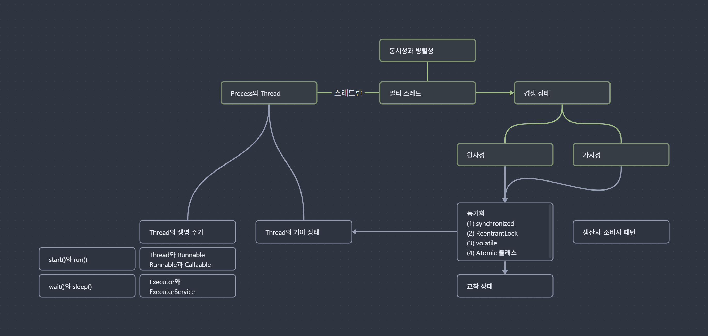

# 개요
「 자바 코딩 인터뷰 완벽 가이드 」의 16장 동시성 파트를 읽는데 인터뷰 질문-답 형식이라 설명이 얕게 느껴졌고, 개념 연결이 매끄럽지 않아 따로 정리하게 됐다. 부족한 부분은 추가 자료 조사를 통해 개념과 실제 사례를 보충했고, 내가 이해하기 쉬운 순서로 흐름을 재구성하였다.

이번 글에서는 동시성/병렬성, 멀티 스레드, 멀티 스레드로 인해 발생하는 문제점과 해결책(동기화)에 대해 정리한다.



## 왜 멀티 스레드를 알아야 할까?

멀티스레드는 하나의 프로그램이 여러 작업을 수행할 수 있도록 도와준다. 예를 들어, 웹서버가 수천 명의 사용자 요청을 **동시**에 처리하거나, 게임에서 캐릭터가 움직임과 **동시**에 배경 음악이 재생되려면 **멀티스레드**는 필수다. 

> 단, 여러 프로그램을 **병렬**적으로 실행시키는 **멀티 프로세스**와는 다른 개념이다.

<br/>

# 멀티 스레드란
멀티 스레드에 대해 이해하려면 먼저 **프로세스와 스레드의 차이**, 그리고 **동시성과 병렬성**에 대해 알아야 한다.

## 프로세스와 스레드
> 자세한 내용은 [프로세스-스레드-차이](https://inpa.tistory.com/entry/%F0%9F%91%A9%E2%80%8D%F0%9F%92%BB-%ED%94%84%EB%A1%9C%EC%84%B8%EC%8A%A4-%E2%9A%94%EF%B8%8F-%EC%93%B0%EB%A0%88%EB%93%9C-%EC%B0%A8%EC%9D%B4#%ED%94%84%EB%A1%9C%EC%84%B8%EC%8A%A4_process) 해당 글이 잘 정리되어 있어 참고하면 좋다.

- **프로세스**란 <u>실행 중인 프로그램</u>을 의미하며, **독립적인 메모리 공간**을 할당 받는다.
	- ex) 크롬 브라우저, 노션, 디스코드 등 실행중인 프로그램
- **스레드**는 프로세스 내에서 실행되는 <u>작업 단위</u>로, **같은 프로세스 내** 다른 스레드들과 **메모리를 공유**한다.
	- ex) 디스코드 - 음성 채팅과 텍스트 채팅 동시에 가능

<br/>

## 동시성과 병렬성
멀티 스레드가 어떻게 동작하는지 이해하려면, 먼저 “동시에 실행된다”라는 말이 정확히 어떤 의미인지 짚고 넘어가야 한다.

> **CPU**는 기본적으로 **한 번에 하나의 작업만 처리**할 수 있다. (**싱글 코어** 기준)

그런데 게임에서 캐릭터를 움직이면서, 배경 음악도 듣고, 게임 내 채팅까지 동시에 하고 있는 것 아닌가?라고 생각할 수 있다.

사실 이런 일들은 진짜 동시에 실행되는 것이 아니라, CPU가 아주 빠르게 작업 대상을 바꿔가며 실행하고 있을 뿐이다. 이러한 과정을 **Context Switching(문맥 교환)**이라고 부른다. CPU는 현재 실행 중인 스레드의 상태를 저장해두고, 다른 스레드의 상태를 불러와 이어서 수행한다. 이 전환이 아주 빠르게 이루어지기 때문에, 사용자 입장에서는 마치 여러 작업이 동시에 실행되는 것처럼 보인다.

그리고 이런 전환의 흐름을 관리하는 주체가 바로 운영체제의 **스케줄러**다. 스케줄러는 언제 어떤 스레드를 얼마나 실행할지를 판단해서 CPU를 할당해준다. 여기서 중요한 것은 스레드는 자신이 얼마나 오래 실행될지, 언제 다른 스레드로 교체될지 모른다는 점이다. 


이처럼 **싱글 코어**에서 여러 작업을 번갈아 수행해가면서 **마치 동시에 실행되는 것처럼 보이는** 현상을 **동시성(Concurrency)**이라고 부른다.
- ex) 음식점 직원이 한 명 뿐인데, 주문도 받고, 요리도 하고, 서빙까지 전부 혼자서 하는 것

반면, **멀티 코어**를 활용해서 **실제로 동시에 여러 작업을 수행하는 것**을 **병렬성(Parallelism)**이라고 한다.
- ex) 음식점에 직원이 여러 명 있어서, 각자 주문, 요리, 서빙을 담당하는 것

<br/>

## 멀티 프로세스와 멀티 스레드
**멀티 태스킹**을 구현하는 방법으로는 멀티 프로세스와 멀티 스레드가 있다.

- **멀티 프로세스**는 여러 개의 독립된 프로세스를 실행해서 작업을 나누는 것이다.
	- 각 프로세스는 메모리 공간을 공유하지 않기 때문에, 안정성은 높지만 리소스 소모가 크다.
- **멀티 스레드**는 하나의 프로세스 안에서 여러 작업을 나누어서 처리한다.
	- 스레드끼리 메모리를 공유하기 때문에 리소스 소모가 적지만, 이 때문에 예기치 못한 결과로 이어질 수 있다.

<br/>

# 🏃 멀티 스레딩은 경쟁 상태를 일으킨다.
멀티 스레드는 프로세스 내 공유 자원을 함께 사용할 수 있다. 만약 이러한 공유 자원에 두 개 이상의 스레드가 **동시에** 접근한다면 어떻게 될까?

블로그 방문자 수를 카운트하는 예제를 들어보자.

```java
public class Counter {
	private int count = 0;

	public void increment() {
		count++;
	}
	
	public int getCount() {
		return count;
	}
}

Thread A: increment 호출 // 사용자 A가 방문
Thread B: increment 호출 // 사용자 B가 방문
```

동일한 자원인 블로그 방문자 수 자원에 두 개의 스레드가 동시에 접근하는 상황이다.

2명의 사용자가 방문했으므로 count가 2가 되기를 바라지만,
실제로 스레드가 동시에 실행되면 결과가 1로 나오는 등 잘못된 결과가 나올 수 있다.

이처럼 여러 스레드가 같은 공유 자원을 동시에 수정할 때, 일관된 결과가 나오지 않는 상태를 **경쟁 상태(Race Condition)**라고 한다.

왜 이런 문제가 생기는 것일까?

<br/>

# ✍️ 경쟁 상태가 발생하는 2가지 원인
멀티 스레드 환경에서는 다음 두 가지 특성이 지켜지지 않으면, 정상적인 결과를 기대할 수 없다.

## 1️⃣ <span style='color:#20bf6b'>원자성</span>: 한 번에 처리되지 않으면 <span style='color:#20bf6b'>스레드 간 간섭</span>이 발생할 수 있다.
원자성은 어떤 동작이 도중에 중단될 수 없는, 즉 “한 번에” 실행됨을 보장하는 성질을 말한다.

`count++` 는 단순한 한 줄의 명령어로 보이지만, 실제로는 세 단계로 나뉘어 수행된다:
1. 현재 `count` 값을 읽는다. 
2. 값에 1을 더한다.
3. 다시 `count` 에 저장한다.

이 작업들이 하나의 묶음으로 끊기지 않고 수행되어야 안전하지만, 그렇지 않다면 그 사이에 다른 스레드가 끼어들어 예상대로 동작하지 않을 수 있다.

예를 들어, 스레드 A와 스레드 B가 동시에 `increment()` 를 호출했다고 하자.
1. [스레드 A] count 읽기 : `0`
2. [스레드 B] count 읽기 : `0`
3. [스레드 A] count에 1 더하기 : `0 + 1` 
4. [스레드 B] count에 1 더하기 : `0 + 1` 
5. [스레드 A] 결과값 count에 저장하기: `count = 1`
6. [스레드 B] 결과값 count에 저장하기: `count = 1`

실제 방문자는 2명이어야 하지만, 간섭한 B에 의해 결과는 1로 덮어씌워졌다. 이것이 바로 **원자성이 깨졌을 때 발생하는 간섭**이다.

## 2️⃣ <span style='color:#20bf6b'>가시성</span>: <span style='color:#20bf6b'>메모리 일관성 오류</span>, 값을 변경해도 다른 스레드가 못볼 수 있다.
가시성은 한 스레드의 변경이 다른 스레드에 즉시 보이는 성질을 말한다.

멀티 스레드 환경에서 **각 스레드는** 자신이 실행되는 CPU 코어의 로컬 **캐시를 통해 변수 값을 읽고 쓸 수 있다**. 문제는 한 스레드가 값을 변경해도, **그 결과가 곧바로 메인 메모리에 반영되지 않을 수도 있다**는 점이다. 그러면 다른 스레드는 여전히 **자신의 캐시에서 오래된 값을 읽게** 된다.

예를 들어, `count = 0` 인 필드를 공유한다고 가정하자.
- 스레드 A가 `count++` 를 한 후
- 스레드 B가 `count` 를 출력했는데

스레드 A의 결과가 스레드 B에 보여지지 않아, 0이 출력될 수 있다.

이러한 현상은 메모리 계층 구조와 관련되어 있다. 일반적으로 CPU는 L1, L2 캐시와 상호작용하는데, 이 **캐시는 코어마다 독립적**이다. 따라서 한 스레드의 변경을 다른 스레드가 감지하려면, 스레드끼리 공유하고 있는 <b>메인 메모리에 값을 반영(flush)</b>하고, 다른 스레드가 **메인 메모리에서 값을 읽어와야(invalidate)** 한다.

이 과정을 수행하는 것이 바로 **Memory Barrier**다.

Memory Barrier는 다음 두 가지 역할을 수행한다.
1. **flush**: 쓰기 시, 캐시의 값을 메인 메모리에 반영한다.
2. **invalidate**: 읽기 시, 메인 메모리의 값을 가져와 로컬 캐시를 무효화하고 갱신한다.

그리고 이런 Memory Barrier의 효과가 보장되려면, Java Memory Model에서 정의하고 있는 **happens-before 관계**여야 한다.
즉 한 스레드의 쓰기(write)가 다른 스레드의 읽기(read)보다 먼저 일어난다는 논리적 순서가 명확히 보장되어야, 값이 올바르게 전달된다는 이야기다.

대표적으로 `synchronized`, `volatile`, `Thread.start()`, `Thread.join()` 과 같은 구문들이 `happens-before` 관계를 형성할 수 있다.

> 자세한 내용은 [Memory Consistency 속성](https://docs.oracle.com/javase/8/docs/api/java/util/concurrent/package-summary.html#MemoryVisibility) 문서에서 확인할 수 있다.


<br/>


# ✅ 동기화로 경쟁 상태를 해결하자
멀티 스레드 환경에서 발생하는 경쟁 상태는 결국 **공유 자원을 여러 스레드가 동시에 접근할 수 있다는 점**에서 비롯된다.
즉 하나의 값을 둘 이상이 동시에 읽고 쓰는 상황에서 어떻게 그 값을 안전하게 관리할 것인가가 핵심이다.

이 문제를 해결하기 위해서는 다음과 같은 두 가지 조건이 충족되어야 한다.
1. 여러 스레드가 **동시에 값을 변경할 때, 원자성을 보장**하여 스레드 간 간섭이 발생하지 않도록 해야 하고
2. **한 스레드의 변경이** 다른 스레드에게 **즉시 보이도록** 만들어야 한다. 

이 조건들을 충족하기 위해 사용하는 기법을 **동기화(synchronization)**라고 한다.

Java에서는 이러한 동기화를 위해 다음과 같은 동기화 도구들을 제공한다.
- `synchronized` : 원자성, 가시성 모두 보장
- `volatile` : 가시성만 보장
- `Lock` (`ReentrantLock`) : 원자성, 가시성 모두 보장
- `Atomic` 변수 : 원자성, 가시성 모두 보장
- 그 외 `java.util.concurrent` 패키지

> 각 도구는 보장하는 성질이 달라, 상황에 따라 적절한 선택이 필요하다.

<br/>

# 마무리
멀티 스레드는 성능과 응답성을 높이지만, 적절한 동기화가 없으면 원자성, 가시성 문제로 경쟁 상태가 발생할 수 있다. 따라서 멀티 스레드 프로그래밍을 하기 위해서는 동기화 기법은 필수로 알아야 한다. 다음 글에서는 Java에서 제공하는 동기화 방식과 함께, 동기화로 인해 발생할 수 있는 교착 상태(DeadLock)에 대해 자세히 정리할 예정이다.


<br/>

# 참고
- 자바 코딩 인터뷰 완벽 가이드
- Effective Java 3/E
- [프로세스-스레드-차이](https://inpa.tistory.com/entry/%F0%9F%91%A9%E2%80%8D%F0%9F%92%BB-%ED%94%84%EB%A1%9C%EC%84%B8%EC%8A%A4-%E2%9A%94%EF%B8%8F-%EC%93%B0%EB%A0%88%EB%93%9C-%EC%B0%A8%EC%9D%B4#%ED%94%84%EB%A1%9C%EC%84%B8%EC%8A%A4_process)
- [Atomicity, Visiblity and Ordering](https://jeremymanson.blogspot.com/2007/08/atomicity-visibility-and-ordering.html)
- [Java Tutorials > Concurrency > Synchronization](https://docs.oracle.com/javase/tutorial/essential/concurrency/sync.html)


